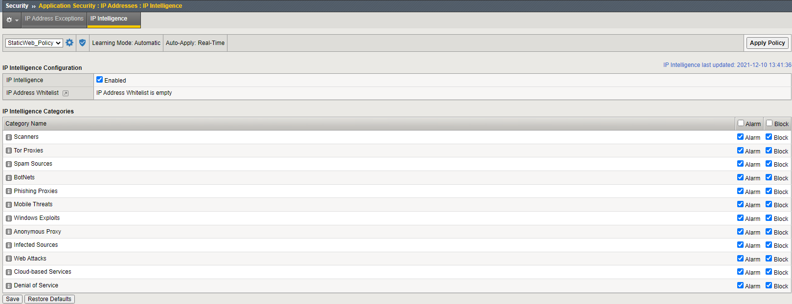
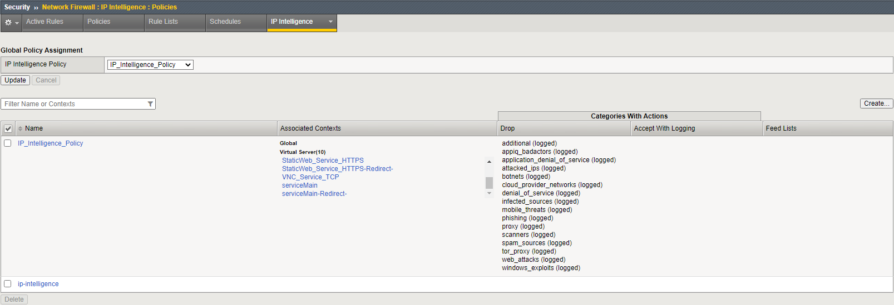

# Troubleshoot IP Reputation Provisioning

The below procedure applies ***only*** to BIG-IP 15.1.4 and later for BIG-IP 15.1.x branch.

References:
- [ ] [K03011490: Verifying connectivity for the IPI Subscription service](https://support.f5.com/csp/article/K03011490) .
- [ ] [K18514842: Verification of IPI Subscription service verification using tmsh command](https://support.f5.com/csp/article/K18514842)
- [ ] [Manual Chapter : Enabling IP Address Intelligence](https://techdocs.f5.com/kb/en-us/products/big-ip_ltm/manuals/product/ltm-implementations-13-1-0/8.html)

Turn on the `Debug` level first. Follow the below example commands:

```
[admin@ip-10-1-1-241:Active:Standalone] ~ # tmsh
admin@(ip-10-1-1-241)(cfg-sync Standalone)(Active)(/Common)(tmos)# modify sys db log.iprep.level value Debug
admin@(ip-10-1-1-241)(cfg-sync Standalone)(Active)(/Common)(tmos)# save sys config
Saving running configuration...
  /config/bigip.conf
  /config/bigip_base.conf
  /config/bigip_script.conf
  /config/bigip_user.conf
  /config/partitions/CloudLibsLocal/bigip.conf
Saving Ethernet map ...done
Saving PCI map ...
 - verifying checksum .../var/run/f5pcimap: OK
done
 - saving ...rdone
admin@(ip-10-1-1-241)(cfg-sync Standalone)(Active)(/Common)(tmos)# restart sys service iprepd
admin@(ip-10-1-1-241)(cfg-sync Standalone)(Active)(/Common)(tmos)# quit
```

Find out details of the unit you're working on:

```
[admin@ip-10-1-1-241:Active:Standalone] ~ # grep Uid /var/log/iprepd/iprepd.log
iprepd|DEBUG|Dec 10 13:06:02.375|15689|Licensed: 1, Uid=1688699885, Device ID=IPIntelligence-EVAL-Z100a
```

Take notes the `Uid` and `Device ID` values, as you'll need those below.

Execute the following command with replacing the `<DEVICEID>` and `<UID>` fields respectively with the value you takes notes before:
`curl -skvv 'https://api.bcti.brightcloud.com/1.0/ip/getthreatlist?oemid=F5&deviceid=<DEVICEID>&uid=<UID>' | jq .`

Following the above example:

```
[admin@ip-10-1-1-241:Active:Standalone] ~ # curl -skvv 'https://api.bcti.brightcloud.com/1.0/ip/getthreatlist?oemid=F5&deviceid=IPIntelligence-EVAL-Z100a&uid=1688699885' | jq .
*   Trying 3.108.204.169...
* Connected to api.bcti.brightcloud.com (3.108.204.169) port 443 (#0)
* ALPN, offering h2
* ALPN, offering http/1.1
* Cipher selection: ALL:!EXPORT:!EXPORT40:!EXPORT56:!aNULL:!LOW:!RC4:@STRENGTH
* successfully set certificate verify locations:
*   CAfile: /etc/pki/tls/certs/ca-bundle.crt
  CApath: none
* TLSv1.2 (OUT), TLS header, Certificate Status (22):
} [5 bytes data]
* TLSv1.2 (OUT), TLS handshake, Client hello (1):
} [512 bytes data]
* TLSv1.2 (IN), TLS handshake, Server hello (2):
{ [89 bytes data]
* TLSv1.2 (IN), TLS handshake, Certificate (11):
{ [4976 bytes data]
* TLSv1.2 (IN), TLS handshake, Server key exchange (12):
{ [333 bytes data]
* TLSv1.2 (IN), TLS handshake, Server finished (14):
{ [4 bytes data]
* TLSv1.2 (OUT), TLS handshake, Client key exchange (16):
} [70 bytes data]
* TLSv1.2 (OUT), TLS change cipher, Client hello (1):
} [1 bytes data]
* TLSv1.2 (OUT), TLS handshake, Finished (20):
} [16 bytes data]
* TLSv1.2 (IN), TLS change cipher, Client hello (1):
{ [1 bytes data]
* TLSv1.2 (IN), TLS handshake, Finished (20):
{ [16 bytes data]
* SSL connection using TLSv1.2 / ECDHE-RSA-AES128-GCM-SHA256
* ALPN, server did not agree to a protocol
* Server certificate:
*        subject: CN=*.bcti.brightcloud.com
*        start date: Sep 29 00:00:00 2021 GMT
*        expire date: Oct 27 23:59:59 2022 GMT
*        issuer: C=US; O=Amazon; OU=Server CA 1B; CN=Amazon
*        SSL certificate verify ok.
} [5 bytes data]
> GET /1.0/ip/getthreatlist?oemid=F5&deviceid=IPIntelligence-EVAL-Z100a&uid=1688699885 HTTP/1.1
> Host: api.bcti.brightcloud.com
> User-Agent: curl/7.47.1
> Accept: */*
>
{ [5 bytes data]
< HTTP/1.1 200 OK
< Access-Control-Allow-Headers: Content-Type
< Access-Control-Allow-Origin: *
< Cache-Control: private
< Content-Type: application/json; charset=utf-8
< Date: Fri, 10 Dec 2021 05:09:28 GMT
< Server: Microsoft-IIS/10.0
< X-AspNet-Version: 4.0.30319
< X-Powered-By: ASP.NET
< Content-Length: 2116
< Connection: keep-alive
<
{ [2116 bytes data]
* Connection #0 to host api.bcti.brightcloud.com left intact
{
  "status": 200,
  "type": "ip",
  "results": [
    {
      "ip": "getthreatlist",
      "queries": {
        "getthreatlist": {
          "threats": [
            {
              "bit": 0,
              "category": "Spam Sources",
              "desc": "Spam Sources includes Tunneling Spam messages through proxy, anomalous SMTP activities, Forum Spam activities"
            },
            {
              "bit": 1,
              "category": "Windows Exploits",
              "desc": "Windows exploit category includes active IP Address offering or distributing malware, shell code, rootkits, worms or viruses"
            },
            {
              "bit": 2,
              "category": "Web Attacks",
              "desc": "Web attacks category includes cross site scripting, iFrame injection, SQL injection, cross domain injection, or domain password brute force attack"
            },
            {
              "bit": 3,
              "category": "BotNets",
              "desc": "Botnet category includes Botnet C&C channels, and infected zombie machine controlled by Bot master"
            },
            {
              "bit": 4,
              "category": "Scanners",
              "desc": "Scanners category includes all reconnaissance such as probes, host scan, domain scan and password brute force attack"
            },
            {
              "bit": 5,
              "category": "Denial of Service",
              "desc": "Denial of Services category includes DOS, DDOS, anomalous sync flood, anomalous traffic detection"
            },
            {
              "bit": 6,
              "category": "Reputation",
              "desc": "Deny access from IP addresses currently known to be infected with malware. This category also includes IPs with average low Webroot Reputation Index score. Enabling this category will prevent access from sources identified to contact malware distribution points"
            },
            {
              "bit": 7,
              "category": "Phishing",
              "desc": "Phishing category includes IP addresses hosting phishing sites, other kind of fraud activities such as Ad Click Fraud or Gaming fraud"
            },
            {
              "bit": 8,
              "category": "Proxy",
              "desc": "Proxy category includes IP addresses providing proxy and def services"
            },
            {
              "bit": 11,
              "category": "Mobile Threats",
              "desc": "Mobile Threat category includes IP addresses of malicious and unwanted mobile applications. This category leverages data from Webroot mobile threat research team"
            },
            {
              "bit": 13,
              "category": "Tor Proxy",
              "desc": "Tor proxy category includes IP addresses acting as exit nodes for the Tor Network. Exit nodes are the last point along the proxy chain and make a direct connection to the originator’s intended destination"
            }
          ]
        }
      }
    }
  ]
}
```

The above indicates successful connection to the BrightCloud service.

Do NOT forget to turn off the `Debug` level to the previous level. Follow the below example commands:

```
[admin@ip-10-1-1-241:Active:Standalone] ~ # tmsh
admin@(ip-10-1-1-241)(cfg-sync Standalone)(Active)(/Common)(tmos)# modify sys db log.iprep.level value Info
admin@(ip-10-1-1-241)(cfg-sync Standalone)(Active)(/Common)(tmos)# save sys config
Saving running configuration...
  /config/bigip.conf
  /config/bigip_base.conf
  /config/bigip_script.conf
  /config/bigip_user.conf
  /config/partitions/CloudLibsLocal/bigip.conf
Saving Ethernet map ...done
Saving PCI map ...
 - verifying checksum .../var/run/f5pcimap: OK
done
 - saving ...done
admin@(ip-10-1-1-241)(cfg-sync Standalone)(Active)(/Common)(tmos)# restart sys service iprepd
admin@(ip-10-1-1-241)(cfg-sync Standalone)(Active)(/Common)(tmos)# quit
[admin@ip-10-1-1-241:Active:Standalone] ~ #
```

Check the IP Reputation process status.

```
[admin@ip-10-1-1-241:Active:Standalone] ~ # tmsh show sys iprep-status

-----------------------------------------------------------------------
Sys::IP Reputation Database Status
-----------------------------------------------------------------------
Last time the server was contacted for updates      12/10/2021 12:57:24
Last time an update was received                    12/10/2021 12:57:24
Total number of IP Addresses in the database                    3800673
Number of IP Addresses received in the last update                   39
```

Test with some BAD IP Address. You need to know which IP Address is bad first, before the test.
Following example IP Address from `1.10.16.1` to `1.10.16.175` are known as `Spam Sources` at the time of writing this document.

```
[admin@ip-10-1-1-241:Active:Standalone] ~ # iprep_lookup 1.10.16.1
opening database in /var/IpRep/F5IpRep.dat
size of IP reputation database = 26604711
iprep threats list for ip = 1.10.16.1 is:
        bit 0 - Spam Sources
[admin@ip-10-1-1-241:Active:Standalone] ~ # iprep_lookup 1.10.16.175
opening database in /var/IpRep/F5IpRep.dat
size of IP reputation database = 26604711
iprep threats list for ip = 1.10.16.175 is:
        bit 0 - Spam Sources
```

Note that IP Reputation DB is very dynamic.
One day an IP Address can be categorized, the other day the same IP Address can be removed from the DB.
Also, there are a few DB source available in the Internet.
An IP Address can fall into one category in BrightCloud's DB, but can be not cetegorized or cetagorized differently in other vendor's DB.

After the above tests are all OK, you can use the DB in either or both on Application Security configuration:



And Network Firewall configuration:




<br><br><br>

***

<br><br><br>
```
╔═╦═════════════════╦═╗
╠═╬═════════════════╬═╣
║ ║ End of Document ║ ║
╠═╬═════════════════╬═╣
╚═╩═════════════════╩═╝
```
<br><br><br>


